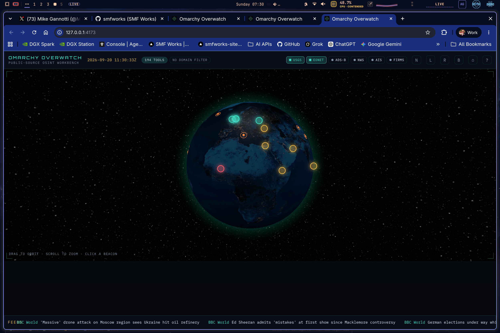
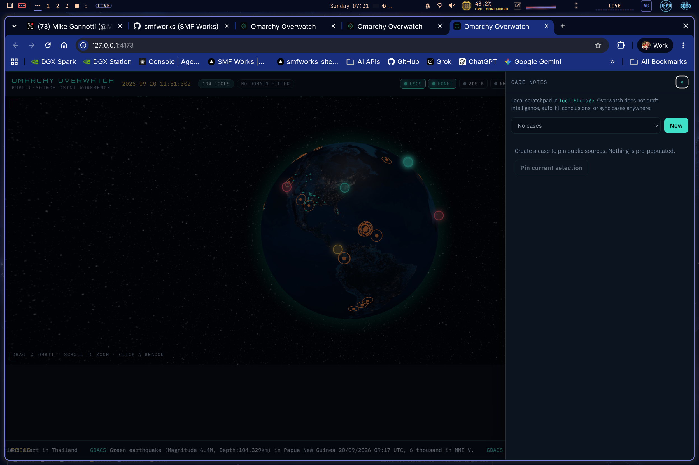

# Overwatch OSINT for Omarchy

Dark-theme OSINT **workbench** for [Omarchy Linux](https://omarchy.org/): a configurable HUD, an interactive globe, locality / storm maps, and a curated catalog of **public** investigation sources.

The product name is **Overwatch OSINT for Omarchy**. The GitHub repo stays [`smfworks/omarchy-overwatch`](https://github.com/smfworks/omarchy-overwatch) and the CLI/bin remains `omarchy-overwatch` so existing install paths keep working.

It is a **dashboard + launcher**, not a SpiderFoot/Maltego/Recon-ng clone. It does not scan networks, steal credentials, or fabricate intelligence.

**Author:** SMF Works · **License:** MIT

## Lawful use

Use this software only to research information you are legally allowed to access. Overwatch OSINT for Omarchy:

- catalogs third-party public websites and self-hosted tools
- visualizes **public** GeoJSON / RSS / ADS-B feeds when they respond
- never claims completeness, freshness, or operational accuracy
- labels each catalog entry **passive** vs **active** OPSEC

**Passive** means the tool primarily queries an existing public index. **Active** means your browser, your IP, or the vendor will contact a third party (and possibly the target). Both can still be logged. You are responsible for accounts, ToS, privacy law, and workplace policy.

Do not use this HUD to attempt unauthorized access, credential stuffing, malware operations, or harassment.

## Demo

[](docs/demo.mp4)

**v2 full feature tour** (~75s): help overlay, catalog + search, dossier/ticker docks, live layer toggles (USGS / EONET / ADS-B / NWS / AIS / FIRMS), globe orbit + beacon, case notes create/note — [`docs/demo.mp4`](docs/demo.mp4)

## Screenshots

Captures from Omarchy on mikesai6 (`npm run preview` at `127.0.0.1:4173`):

| | |
| --- | --- |
|  | Globe + USGS/EONET LIVE, ticker, status strip |
|  | Case notes drawer (`n` / **N**) — local scratchpad only |

## Quick start

Requires Node.js 20+ and npm.

```bash
npm install
npm test
npm run dev          # http://127.0.0.1:5173
```

Production-style static preview (also used on Omarchy):

```bash
npm run build
npm run preview      # http://127.0.0.1:4173
```

## Omarchy / Arch install

The install script copies or uses this tree under `~/Apps/omarchy-overwatch` (or `~/.local/share/omarchy-overwatch`), builds the UI, and installs a `.desktop` launcher.

On a machine named **mikesai6** (or any Omarchy box):

```bash
git clone https://github.com/smfworks/omarchy-overwatch.git
cd omarchy-overwatch
chmod +x scripts/install.sh
./scripts/install.sh                  # default: ~/Apps/omarchy-overwatch
# or:
./scripts/install.sh ~/.local/share/omarchy-overwatch
```

Then start from the app menu (**Overwatch OSINT for Omarchy**) or:

```bash
~/.local/bin/omarchy-overwatch
```

The launcher starts `npm run preview` on `127.0.0.1:4173` if needed, then opens the HUD as an **Omarchy web app** via `omarchy-launch-webapp` (Chromium/Chrome `--app=` mode) — a chrome-free full-view window with no browser tabs or URL bar, same as YouTube/X on Omarchy. A second launch focuses the existing Overwatch window when `omarchy-launch-or-focus-webapp` is available. If those helpers are missing, it falls back to Chromium/Chrome `--app=` and finally `xdg-open`.

The `.desktop` `Exec` always points at this launcher (not a bare URL) so the preview server is up before the app window opens.

Dependencies on Arch/Omarchy:

```bash
sudo pacman -S --needed git nodejs npm chromium xdg-utils
```

## Layout

Docks persist in `localStorage` (`omarchy-overwatch.layout.v1`):

| Dock | Default | Contents |
| --- | --- | --- |
| Left | on | Category chips, search, **selectable** tool cards |
| Right | on | Tool / hotspot / live-point / headline dossier + Open / Pin / Inspect |
| Top | on | Clock, filters, live-layer toggles, case-notes control |
| Bottom | on | BBC World / ReliefWeb / GDACS + custom RSS ticker (honest empty/ERR) |

Resize the inner edges. Hide with the × buttons or keys `1` `2` `3` `4`. Reset with the home icon.

Selecting a catalog card or ticker headline opens an **in-depth center stage** (replacing the globe) with every field we already know. Selecting a hotspot, live point, or attention cell flies the globe into that locality, then opens a **map detail mode**. **← Globe** (or `Esc` / `b`) restores the globe and prior camera when we still have it.

## Keyboard

| Key | Action |
| --- | --- |
| `/` | Focus catalog search |
| `Esc` | Close help → close case notes → back to globe → clear selection → clear query |
| `b` | Back to globe from map / storm / depth / brief |
| `1` / `2` / `3` / `4` | Toggle left / right / top / bottom |
| `n` | Case notes drawer |
| `[` / `]` | Cycle map basemap DEFAULT / SATELLITE / NIGHT |
| `?` | Help overlay |

## Globe layers

Toggles in the status strip. Status is **LIVE**, **STALE**, **ERR**, or **OFF** — never invented points.

Enabled layers **poll** on their own cadence (about 45s–3 min). Glowing globe highlights are driven by the latest live/stale points. Curated demo beacons stay as navigation only. Add a row in `src/globe/registry.ts` to register a new public layer (fetch + poll + LIVE/STALE/ERR/OFF) — do not invent points.

| Layer | Source | Key |
| --- | --- | --- |
| USGS | `earthquake.usgs.gov` GeoJSON (M2.5+ day) | none |
| EONET | NASA natural events | none |
| ADS-B | sampled `opensky-network.org` states | optional; see below |
| NWS | `api.weather.gov` (US) | none |
| AIS | AISStream WebSocket snapshot (`stream.aisstream.io`) | `AISSTREAM_API_KEY` |
| FIRMS | NASA FIRMS VIIRS 24h detections | optional `FIRMS_MAP_KEY` |
| GDACS | GDACS SEARCH GeoJSON + feed bbox; sampled TC/FL polygons | none |
| SAT | CelesTrak TLE sample (stations + visual), SGP4 in a Web Worker | none |
| NHC | `nhc.noaa.gov/CurrentStorms.json` | none |
| NIFC | WFIGS current incident perimeters (public ArcGIS GeoJSON) | none |
| RW | ReliefWeb disasters API — only records with coordinates | none |

**Tracks (ADS-B / AIS):** when a layer is LIVE or STALE, heading-aware chevrons are drawn if the feed sent heading/course. Short polylines come from a client ring buffer (capped samples per id, capped ids, antimeridian split). This is a **sampled** trail of polls Overwatch already made — not full-sky coverage, not a tracker product. Click a marker or trail to open the dossier with speed / course / altitude **only when the feed sent them**. OpenSky **401/429** and AIS missing-key **401** stay honest **ERR** with no invented tracks.

Demo **hotspots** (Kyiv, Hormuz, Suez, Taiwan Strait, etc.) are static geography for navigation. Clicking one opens a dossier of related catalog tools, not a live situation report.

Dev and `vite preview` proxy `/proxy/*` so the browser can reach those APIs. Direct static file hosting without the Vite preview proxy will show **ERR** on layers/feeds that lack CORS — that is expected and honest.

### Locality / storm maps (style pack)

`react-globe.gl` is weak for roads and borders at city scale, so a selected hotspot, live point, or attention cell transitions into a **MapLibre GL** detail view. Toggle **DEFAULT / SATELLITE / NIGHT** on the map (or HUD **MAP** chip, keys `[` `]`). Choice persists in `omarchy-overwatch.mapstyle.v1`.

| Style | Tiles | Attribution | Notes |
| --- | --- | --- | --- |
| **DEFAULT** | Public [OpenStreetMap](https://www.openstreetmap.org/copyright) raster (`tile.openstreetmap.org`) | © OpenStreetMap contributors | Same keyless path as v2. No Mapbox / Google key. |
| **SATELLITE** | [Esri World Imagery](https://www.arcgis.com/home/item.html?id=10df2279f9684e4a9f6a7f08febac2a9) raster | Tiles © Esri — Source: Esri, Maxar, Earthstar Geographics, and the GIS User Community | Keyless. If Esri 403s/fails, the map is empty — imagery is never invented. |
| **NIGHT** | [OpenFreeMap](https://openfreemap.org/) dark vector (`tiles.openfreemap.org/styles/dark`) | © OpenFreeMap © OpenMapTiles © OpenStreetMap contributors | Live style URL (no frozen sprite host). Vector paint failure falls back to darkened OSM raster. |

**NVG** is an optional green CSS overlay — aesthetic only, not a night-vision sensor. Offline / failed tiles: empty map or OSM embed. Streets are never invented.

There is **no** Mapbox, Google Maps, or Stadia key in this HUD. OpenFreeMap is the dark vector source; OSM raster is the compliance-friendly default.

### Storm map

When a selected live point is **dangerous weather** (NWS event types, EONET severe-storms, NHC tropical cyclones, or a GDACS tropical cyclone label), the center opens a storm map:

- The selected basemap style (same pack as locality)
- NWS / GDACS alert geometry when the feed sent it
- Optional [RainViewer](https://www.rainviewer.com/api.html) public radar mosaic (`/proxy/rainviewer`) — no key
- Alert headline / area / severity only when present

Radar **ERR** / empty leaves the alert text and geometry in place. Nothing is synthesized.

### HEAT (attention)

**HEAT** in the status strip is an optional client-side overlay (off by default). It does **not** invent points or produce a classified sitrep.

- Grid: Uber [H3](https://h3geo.org/) resolution **4** (~1,770 km² cells) via `h3-js` (code-split).
- A cell is drawn only when **L ≥ 2**: **L** is the count of distinct **enabled** live/stale layers that already have a real feed point in that cell in the **current in-memory poll** (USGS, EONET, ADS-B, NWS, AIS, FIRMS, plus GDACS / SAT / NHC / NIFC / RW when those toggles are on).
- Color maps from **L** (2 cyan, 3 amber, 4+ red). The dossier also shows **z = (L − mean L) / population σ** among currently drawn attention cells (`z = 0` if fewer than two cells or σ is 0). No ML ranker, no hidden weights.
- Demo hotspots that fall in the same cell are listed as navigation geography and **do not count toward L**.
- Status is **LIVE / STALE / ERR / OFF**. HEAT is **ERR** when fewer than two live layers are enabled. Zero overlapping cells is an honest empty LIVE overlay.
- Click a cell on the locality map (primary) or the subtle globe hex overlay to open a dossier of contributing layers, point counts, and feed event ids/labels/coords copied from the poll.

The same formula is in **Help (`?`)**.

### On-screen brief (optional)

**BRIEF** is off by default. Enable **On-screen brief** in Help (`?`):

- **Local Ollama** at `http://127.0.0.1:11434` (probed via `/proxy/brief/ollama`)
- **OpenAI-compatible HTTPS** (or http loopback): you paste the API base URL + key. Stored only in `localStorage` key `omarchy-overwatch.brief.v1`. Never committed. No bundled cloud key. Overwatch does **not** call any SMF-hosted LLM.

The model receives a **structured JSON dump of what is currently on screen** (layer toggles/status, selection, heat-cell summary, capped live points and ticker headlines). The system prompt requires citing only those items, saying UNKNOWN when missing, and never inventing coordinates or events. Output opens in center stage with a **“model-generated from on-screen public feeds”** banner and **← Globe**. Missing key, Ollama down, or model errors show **ERR** and an empty brief.

Dev/preview proxy: `POST /proxy/brief` (local Vite process only). Direct static hosting without the proxy will ERR — honest.

### Optional env keys

Copy [`.env.example`](.env.example) to `.env` (gitignored) and restart `npm run dev` / `npm run preview`. Keys stay on the local Vite process — they are not committed and are not baked into the static JS bundle.

| Variable | Layer | Notes |
| --- | --- | --- |
| `AISSTREAM_API_KEY` | AIS | Required for LIVE ships. Free key from [aisstream.io](https://aisstream.io). AISStream has **no REST snapshot** and no browser CORS, so Overwatch collects a short sampled WebSocket snapshot via `/proxy/ais/snapshot`. Without a key the toggle is **ERR** and **no vessels are invented**. |
| `OPENSKY_CLIENT_ID` / `OPENSKY_CLIENT_SECRET` | ADS-B | Optional OAuth2 client credentials (current OpenSky REST method). Raises rate limits vs anonymous. |
| `OPENSKY_USERNAME` / `OPENSKY_PASSWORD` | ADS-B | Optional legacy HTTP Basic Auth. OpenSky stopped accepting username/password for REST in 2026; if set, Overwatch still sends them. A **401** is an honest failure. |
| `FIRMS_MAP_KEY` | FIRMS | Optional. The layer tries the public 24h Suomi NPP VIIRS CSV first (no key). If that is blocked, `/proxy/firms/api/active` injects this MAP_KEY into the FIRMS area API. |

OpenSky **401** (unauthorized) and **429** (rate limited) surface as **ERR** with that status — the globe does not paint placeholder aircraft. Anonymous OpenSky is often blocked.

FIRMS points are a **sampled subset** (highest FRP first, capped) so the globe stays usable. Same for AIS (unique MMSI cap), ADS-B (stride sample), SAT (stations + visual TLE groups), NIFC (largest current perimeters), and GDACS (event cap + a handful of polygons).

### Proxies

| Prefix | Upstream |
| --- | --- |
| `/proxy/usgs` | `https://earthquake.usgs.gov` |
| `/proxy/eonet` | `https://eonet.gsfc.nasa.gov` |
| `/proxy/opensky` | `https://opensky-network.org` (auth headers injected when env is set) |
| `/proxy/nws` | `https://api.weather.gov` |
| `/proxy/firms` | `https://firms.modaps.eosdis.nasa.gov` |
| `/proxy/ais/*` | AISStream snapshot/status (local plugin, not a public REST API) |
| `/proxy/bbc` | `https://feeds.bbci.co.uk` |
| `/proxy/reliefweb` | `https://reliefweb.int` |
| `/proxy/gdacs` | `https://www.gdacs.org` |
| `/proxy/celestrak` | `https://celestrak.org` (TLE text) |
| `/proxy/nhc` | `https://www.nhc.noaa.gov` |
| `/proxy/nifc` | `https://services3.arcgis.com` (NIFC WFIGS) |
| `/proxy/rwapi` | `https://api.reliefweb.int` |
| `/proxy/rainviewer` | `https://api.rainviewer.com` (public weather-maps.json) |
| `/proxy/rss?url=` | Generic RSS/Atom fetch (`http`/`https` only) |
| `/proxy/brief` | Local-only BYOK / Ollama chat forwarder (no SMF LLM; key from `X-Overwatch-Brief-Key`) |
| `/proxy/brief/ollama` | Probe `http://127.0.0.1:11434/api/tags` |

## News ticker

Built-in BBC World, ReliefWeb, and GDACS remain. The ⚙ control lets you enable/disable each and add **custom RSS/Atom** URLs (`http`/`https` only). Prefs persist in `omarchy-overwatch.feeds.v1`. Each feed shows **LIVE / STALE / ERR / OFF**. Click a headline to open the depth view (title, source, date, link — no fetched article body). **Pin to case** stores that title/link/date locally.

## Case notes

Local-only investigation scratchpad. Open with **n**, the **N** control in the status strip, or **Pin to case** on a dossier.

- Create / rename / delete cases
- Pin catalog tools, demo hotspots, live-layer points, and ticker headlines (stored as ids, labels, URLs/coordinates — not fabricated intel)
- Freeform notes (plaintext or light markdown; preview is local-only)
- Persist in `localStorage` key `omarchy-overwatch.cases.v1`
- Export / import one case as JSON

Overwatch OSINT for Omarchy never auto-fills notes or pins. Importing JSON creates a **new** case id so it will not silently overwrite another case.

## Catalog

`src/catalog/tools.ts` holds 100+ real public tools spanning every domain listed in the product brief (search, social, network, email, media, people, geo, threat intel, metadata, documents, code, usernames, phones, archives, companies, AIS/ADS-B, viz, news, stats, privacy, finance, weather, conflict, disasters).

Schema: `id, name, category, subcategory?, url, description, tags[], opsec, pricing, inputs[], notes?`.

`npm test` (Vitest) validates schema, unique HTTPS URLs, category coverage, and filters.

## Stack

Vite · React 19 · TypeScript · `react-globe.gl` (Three.js) · MapLibre GL · H3 (`h3-js`) · `satellite.js` (SAT worker) · custom dock layout · dark glass HUD CSS.

Globe night/bump/star textures are bundled under `public/globe/` (from the `three-globe` example set) so the HUD does not fetch unpkg at runtime. Offline machines still get an untextured globe if local files fail — that is acceptable.

## Development notes

See [AGENTS.md](AGENTS.md) for contributor guidance.

## Acknowledgements

Taxonomy inspired by [OSINT Framework](https://osintframework.com/) (`arf.json`) and the [Bellingcat toolkit](https://bellingcat.gitbook.io/toolkit). Live-layer ideas from public USGS / EONET / OpenSky / NWS / GDACS / CelesTrak / NHC / NIFC documentation. Basemap: OpenStreetMap raster (default), Esri World Imagery (satellite, attributed), OpenFreeMap dark (night). Radar mosaic: RainViewer public API. Attention grid: Uber H3. HUD language nods to community OSINT dashboards without copying their code or inventing their data.
